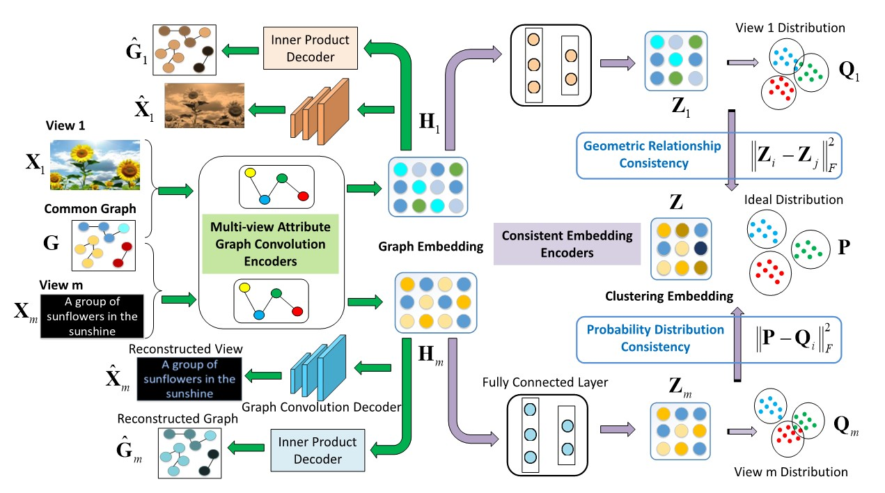
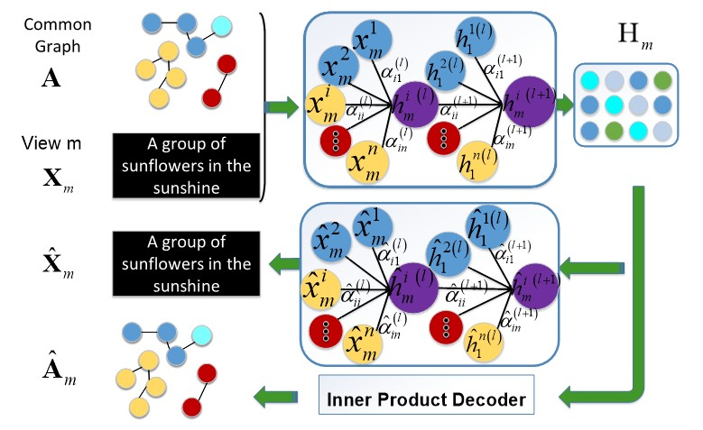

#MAGCN: Multi-View Attribute Graph Convolution Networks for Clustering#

This repo contains the source code and dataset for our IJCAI 2020 paper:  

###Jiafeng Cheng, Qianqian Wang, Deyan Xie, Quanxue Gao, Multi-View Attribute Graph Convolution Networks for Clustering, IJCAI, 2020.###

[Paper Link](https://www.ijcai.org/Proceedings/2020/0411.pdf)

**Bibtex**

@inproceedings{	cheng2020multiview,  
  title={Multi-View Attribute Graph Convolution Networks for Clustering },  
  author={Cheng, Jiafeng and Wang, Qianqian and Tao, Zhiqiang and Gao, Quanxue},  
  booktitle={Twenty-ninth International Joint Conference on Artificial Intelligence IJCAI-20},  
  pages={1--7},  
  year={2020},  
}  

**MAGCN Model:**


<div style="text-align: center; width: 900px; border: green solid 1px;">

<br></br>
<center></center>
</div>


Figure 2: The framework of Multi-View Attribute Graph Convolution Networks for Clustering (MAGCN). It contains two key components: 1) Multi-view attribute graph convolution encoders with attention mechanism: they are used to learn graph embedding from node attribute and graph data. Attribute and graph reconstruction are executed for end-to-end learning. 2) Consistent embedding encoders further obtain a consistent clustering embedding among multiple views through geometric relationship and probability distribution consistency.

**Introduction:  **
Graph neural networks (GNNs) have made considerable achievements in processing graph-structured data. However, existing methods cannot allocate learnable weights to different nodes in the neighborhood and lack of robustness on account of neglecting both node attributes and graph reconstruction. Moreover, most of multi-view GNNs mainly focus on the case of multiple graphs, while designing GNNs for solving graph-structured data of multi-view attributes is still under-explored. In this paper, we propose a novel Multi-View Attribute Graph Convolution Networks (MAGCN) model for the clustering task. MAGCN is designed with two-pathway encoders that map graph embedding features and learn view-consistency information. Specifically, the first pathway develops multi-view attribute graph attention networks to reduce the noise/redundancy and learn the graph embedding features of multi-view graph data. The second pathway develops consistent embedding encoders to capture the geometric relationship and the consistency of probability distribution among different views, which adaptively finds a consistent clustering embedding space for multi-view attributes. Experiments on three benchmark graph databases show the effectiveness of our method compared with several state-of-the-art algorithms.


<div style="text-align: center; width: 900px; border: green solid 1px;">

<br></br>
<center>Figure 1: Part of Multi-view Attribute Graph Convolution Encoder for view m.</center>
</div>

**Dataset:**

In order to evaluate the effectiveness of our proposed approach, we conduct extensive experiments on three citation network databases (Cora, Citeseer and Pubmed) with three evaluation metrics: clustering accuracy (ACC), normalized mutual information (NMI) and average rand index (ARI), and the higher these indicators, the better the clustering effect. The general graph-structured database contains one graph and one attribute and there is no such real graph-structured data with multi-view attributes at present. Due to the databases used in the experiments, the attributes of graph-structured data are {0, 1}, which are discrete structured and also one-sided described. So we make attributes continuous by changing the operation of that, for the purpose of describing the graph structure more abundantly. Inspired by multi-graph, which constructs another graph by themselves, we construct additional attribute views by original attributes. Specifically, we use Fast Fourier Transform (FFT), Gabor transform, Euler transform and Cartesian product to construct view 2 based on view 1.

**Requirements**

Python 3.6  
PyTorch 1.0  

**Train the model**  
```
python train.py
```
